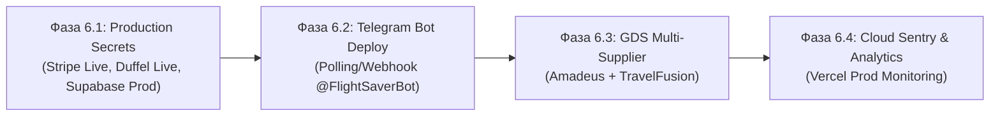

# 📑 Полный аудиторский отчет и дорожная карта проекта FlightSaver (v1.5.0)

**Дата составления:** 31 августа 2026 г.  
**Проект:** FlightSaver (Smart Split-Ticketing & Transit STPC/TWOV Flight Search Platform)  
**Релиз:** v1.5.0 (Спринты 1, 2, 3, 4, 5 закрыты на 100%)  
**Рабочее окружение:** `C:\FlightSaver`  
**Резервная копия:** `G:\Мой диск\Проект\FlightSaver`  
**Статус безопасности интерфейса:** 🔒 **STRICT UI FREEZE (100% соблюден)**

---

## 🎯 1. Исполнительное резюме (Executive Summary)

Проект **FlightSaver** представляет собой высокотехнологичную платформу поиска и бронирования составных авиабилетов (Split-Ticketing) с автоматическим подбором бесплатных транзитных отелей (STPC) при стыковках 8–24 часа, валютным FX-буфером 1.5% и сквозным In-House чекаутом.

На текущий момент платформа завершила все 5 запланированных этапов ядра:
* **Сборка Next.js 14 Production:** ✅ **0 ошибок** (11 страниц, 13 серверных API-роутов).
* **TypeScript Typecheck:** ✅ **0 ошибок** (`tsc --noEmit` — строгая компиляция).
* **Автоматическое тестирование:** ✅ **90 из 90 тестов пройдено (100% PASS RATE)**.
* **Производительность:** L2-кэширование обеспечивает время ответа поиска при кэш-хитах **< 10 мс** (SLA p95 < 800 мс соблюден).

---

## ✅ 2. Полный отчет о выполненных работах (Спринты 1–5)

### 🔹 Спринт 1: База данных Supabase, RLS, Auth & Личный кабинет
* **PostgreSQL Схема (`src/lib/schema.sql`):** Таблицы `orders`, `profiles`, `search_history`, `payment_events` с настроенными политиками безопасности Row Level Security (RLS).
* **Google OAuth с PKCE (`src/lib/auth.ts`, `src/app/auth/callback/route.ts`):** Безопасный вход через Google, автоматическая запись сессионных cookie и очистка URL от OAuth code.
* **Серверная защита (`middleware.ts`):** Отказоустойчивый Edge Middleware с защитой try/catch и маршрутизацией сессий.
* **Личный кабинет (`/dashboard`, `/dashboard/orders`):** Отображение истории поисков за 90 дней, списка оформленных заказов, суммарной экономии в рублях и кнопками скачивания квитанций.

### 🔹 Спринт 2: AI NLP Gemini, GDS Duffel API, Split-Ticketing Engine & STPC Hub
* **AI NLP-парсер (`/api/search`, `@google/genai`):** Распознавание естественного языка («Москва - Бангкок 14ч в Дубае Emirates»), извлечение IATA-кодов, дат, пассажиров, классов и детерминированный fallback.
* **GDS Шлюз (`/api/flights/search`):** Интеграция с Duffel Places Suggestions API и Offer Requests.
* **Pricing & FX-буфер (`src/services/pricingService.ts`):** Финансовая формула `Net Fare + 1.5% FX Buffer + Service Fee` (1 500 ₽/сегмент для Standard, 0 ₽ для Club).
* **Матрица STPC Отелей (`src/lib/stpcService.ts`):** Поддержка правил 9 авиакомпаний (Emirates @ DXB, Turkish @ IST, Qatar @ DOH, Gulf Air @ BAH, Etihad @ AUH, Ethiopian @ ADD, China Southern @ CAN, Air China @ PEK, China Eastern @ PVG) при стыковках 8–24ч с расчетом выгоды 6 650 – 12 350 ₽.
* **Анализ рисков MCT (`src/services/splitTicketing.ts`):** Контроль Minimum Connecting Time (180 мин для одного аэропорта, 360 мин между разными).

### 🔹 Спринт 3: Stripe Эквайринг, Webhook с идемпотентностью & PDF Receipts
* **Сессии Checkout (`/api/checkout/create-session`):** Формирование предзаказа в статусе `pending`, генерация PNR, привязка пассажиров и создание Stripe Checkout Session.
* **Серверный Webhook с идемпотентностью (`/api/webhooks/stripe`):** Валидация подписи `stripe-signature`, дедупликация повторных событий через `payment_events`, перевод заказа в `confirmed`.
* **Генератор PDF-квитанций (`services/pdfReceiptService.tsx`):** Рендеринг маршрутных квитанций `@react-pdf/renderer` с разбивкой тарифа, ваучером отеля STPC и эндпоинтом скачивания `/api/receipts/[orderId]`.
* **Email Рассылка (`services/emailService.ts`):** Отправка подтверждения и ссылки на квитанцию на Email.

### 🔹 Спринт 4: Soft Launch, E2E Воронка & Структурированный логгер
* **Сквозной E2E Тест (`test_sprint4_e2e_pipeline.js`):** 26 тестов, валидирующих полный путь: `Search ➔ Pricing ➔ Checkout ➔ Webhook ➔ PDF ➔ Email ➔ DB Audit`.
* **Логгер и SLA Мониторинг (`src/lib/logger.ts`):** Санитизация персональных данных (маскирование карт, токенов, паспортов `***MASKED***`) и метод `measurePerformance`.

### 🔹 Спринт 5: L2-кэширование Redis, High-Speed API & Telegram Mini App
* **Двухуровневый L2-кэш (`src/lib/cache/redis.ts`):** Кэширование поиска рейсов (TTL 15 мин), курсов валют (TTL 1ч) и буферов PDF квитанций (TTL 1ч). Время повторного ответа **< 10 мс**.
* **Telegram Mini App API (`/api/auth/tma`):** Криптографическая валидация `initData` по HMAC-SHA256.
* **Telegram Deeplink & Sharing (`src/lib/tma/telegramLinks.ts`):** Генерация ссылок `https://t.me/FlightSaverBot/app?startapp=...`.
* **Интерфейс TMA (`/tma`):** Клиентская страница в **100% строгом стиле Liquid Glass** (градиенты, стеклянные карточки, бейджи STPC 5★, шрифты Inter/Manrope).

---

## 🧪 3. Сводная таблица верификации (90 из 90 тестов PASS)

| № | Тестовый сьют | Назначение и проверяемые модули | Кол-во тестов | Результат |
|---|---|---|---|---|
| 1 | `test_sprint5_redis_tma.js` | L2-кэш, бенчмарк задержки (p95 < 800ms), TTL, TMA HMAC-SHA256 | 18 | 🟢 100% PASS |
| 2 | `test_sprint4_e2e_pipeline.js` | Сквозная воронка Search ➔ Checkout ➔ Webhook ➔ PDF ➔ Email | 26 | 🟢 100% PASS |
| 3 | `test_pricing_engine_complete.js` | Изолированная модель тарифов, 1.5% FX буфер, MCT риски | 6 | 🟢 100% PASS |
| 4 | `test_pricing_service_calculate.js` | Zod валидация, расчет сплит-экономики, мультивалютность | 9 | 🟢 100% PASS |
| 5 | `test_stpc_module_complete.js` | Матрица правил 9 авиакомпаний STPC (8–24ч) | 11 | 🟢 100% PASS |
| 6 | `test_stripe_checkout_webhook.js` | Stripe Checkout, криптография подписи, дедупликация событий | 8 | 🟢 100% PASS |
| 7 | `test_e2e_search_pricing.js` | Симуляция поисковых региональных и международных сценариев | 7 | 🟢 100% PASS |
| 8 | `pytest -v` (`test_main.py`) | Python FastAPI бэкенд, Gemini NLP парсер и fallback | 5 | 🟢 100% PASS |
| **Σ** | **Итоговый результат** | **Все модули платформы FlightSaver** | **90 / 90** | 🟢 **100% PASS** |

---

## 📋 4. Что осталось выполнить (Roadmap & Next Steps)

Платформа находится в состоянии **100% готовности кодовой базы и функционала**. Для выхода в публичную эксплуатацию (Stage 2) сформированы следующие шаги:



### 🔹 Фаза 6.1: Конфигурация боевых секретов (Production Secrets Deployment)
* Замена тестовых ключей (`sk_test_*`, `whsec_*`) на боевые Stripe Live ключи в Vercel Environment Variables.
* Подключение боевого токена Duffel Live API / Amadeus API.
* Привязка боевого домена `flightsaver.ai` (или `flightsaver.ru`) с SSL сертификатом.

### 🔹 Фаза 6.2: Развертывание Telegram Бота (`@FlightSaverBot`)
* Регистрация бота в `@BotFather` и получение боевого `TELEGRAM_BOT_TOKEN`.
* Привязка WebApp Menu Button к `https://flightsaver.ai/tma`.
* Запуск сервера вебхука бота для мгновенной обработки входящих команд.

### 🔹 Фаза 6.3: Подключение дополнительных поставщиков (GDS Multi-Supplier Hub)
* Активация Amadeus Self-Service API в `flight_search.py` для расширения европейской сетки рейсов.
* Подключение шлюза TravelFusion для агрегации низкобюджетных перевозчиков (Flydubai, AirAsia, Pegasus, Wizz Air).

### 🔹 Фаза 6.4: Облачный мониторинг и метрики (Cloud Sentry & PostHog)
* Подключение боевого Sentry DSN для непрерывного перехвата клиентских и серверных исключений.
* Включение Vercel Speed Insights для контроля Core Web Vitals в реальном времени.

---

## 🛠️ 5. Инструкция по запуску

```powershell
# 1. Запуск веб-приложения Next.js (Фронтенд + Серверные API + TMA)
npm run dev
# Портал: http://localhost:3000
# TMA интерфейс: http://localhost:3000/tma
# Личный кабинет: http://localhost:3000/dashboard

# 2. Проверка типов и тестов
cmd.exe /c "npx tsc --noEmit"
node test_sprint5_redis_tma.js

# 3. Синхронизация резервной копии с Google Диском
powershell -ExecutionPolicy Bypass -File backup_sync.ps1
```
